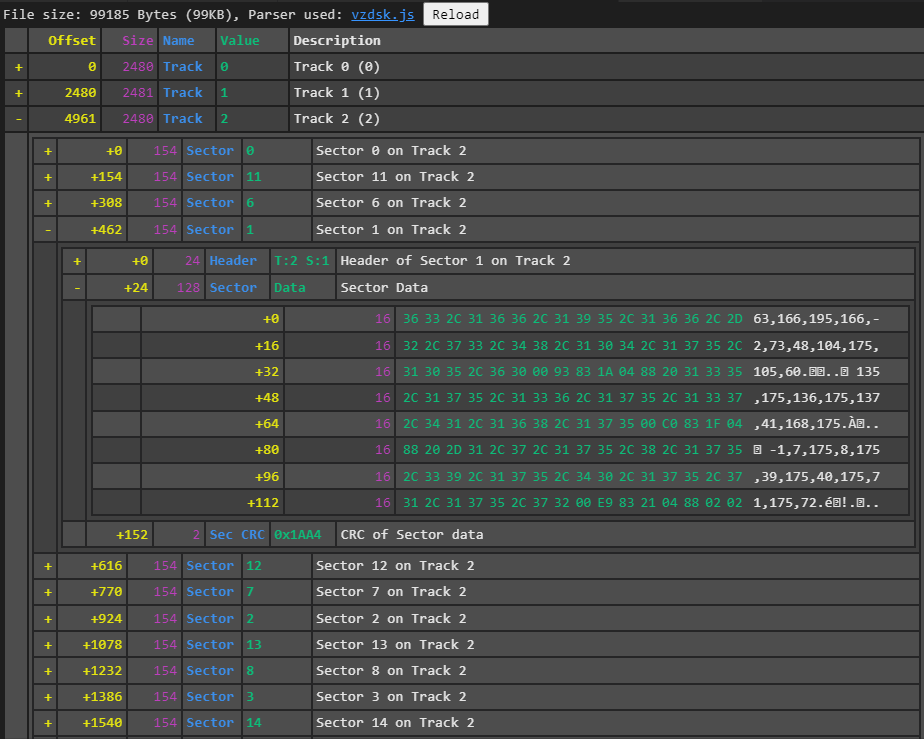

# vz-view-parser

Custom parser to get quick preview of varies VZ200/VZ300 Basic and binary files.

Parser is created to use from [**"Binary File Viewer"**](https://github.com/maziac/binary-file-viewer) by **maziac** VS Code (most likely along with **DeZog** debugger).

VZ BASIC file view

VZ mixed BASIC and Binary file view

VZ Disk Image view

VZ Disk Image Error detected

## Supported files

VZ Files are recognized by File Description Header - 4 bytes at the begining of file commonly used as signature since DOS (like 'RIFF' for *.WAV etc). Disk Image files are considered valid 
if starts with IDAM sequence.

As for now Parser Plugin supports files:
- *.VZ with 'VZF0' [56 5A 46 30] file description header.
- *.VZ with 'VZFO' [56 5A 46 4F] file description header (possibly mistaken change from '0' to 'O').
- *.VZ with '  \0\0' [20 20 00 00] file description header (generated with z88dk tools)
- *.DSK with 40 tracks and 16 sectors per track.
- *.CVZ with 260 bytes Lead in and 20 bytes Lead out

## Supported file content types

### VZ Snapshot file header:

| Offset  | Size     | Description                         |
|---------|----------|-------------------------------------|
|  0      | 4 bytes  | File Description header (see above) |
|  4      | 16 chars | Internal Program Name               |
|  20     | 1 byte   | Text terminator (always 0)          |
|  21     | 1 byte   | Content Type (see below)            |
|  22     | 2 bytes  | 16-bit address to load rest of file |

Content Type byte determines what kind of data are in file starting at offset +24.

As for now Parser supports Content Types:
- 0xf0 BASIC Program 
- 0xf0 BASIC Program/Loader with following binary code 
- 0xf1 Binary program from start to end

### VZ Tape (CVZ) file structure:

| Offset  | Size     | Description                             |
|---------|----------|-----------------------------------------|
|  0      | 255 bytes| Tape Lead in Start sequence of 0x80 byte|
|  255    | 5 bytes  | Tape Lead in End sequence of 0xFE byte  |
|  260    | 1 byte   | Content Type (see below)                |
|  261    | 16* chars| Internal Program Name (max 16 chars)    |
|  277*   | 1 byte   | Text terminator (always 0)              |
|  278*   | 2 bytes  | 16-bit address to Load content          |
|  280*   | 2 bytes  | 16-bit address of End of content        |
|  282*   | x bytes  | content (length = End addr - Load addr) |
|  x+282* | 2 bytes  | 16-bit CRC of content data              |
|  x+284* | 20 bytes | Tape Lead out sequence of 0x00 byte     |

Content Type byte determines what kind of data are in the file.

As for now Parser supports Content Types:
- 0xf0 BASIC Program 
- 0xf0 BASIC Program/Loader with following binary code 
- 0xf1 Binary program from start to end

### DSK Image file structure:

DSK Image file structure:
 - 40 * track data block
 - every track data block contains 16 * sector data
 - every sector data contains 
	- IDAM Header
	- 128 bytes of stored data 
	- 16-bit CRC
 - IDAM Header contains
	- GAP1 sync bytes (0x80,0x80,..0x00) (see NOTE below)
	- IDAM Start sequence (0xfe,0xe7,0x18,0xc3)
	- Track number, Sector Number and CRC of these values
	- GAP2 sync bytes (0x80,0x80,..0x00) (see NOTE below)
	- IDAM End sequence (0xc3,0x18,0xe7,0xfe)
 - Some files contains extra 15 or 16 bytes of 0x00 as a "track separator" after each Track data block (except last one).

NOTE: VZ300 Technical Manual describes GAP1 as 7 bytes of 0x80 + 0x00 and GAP2 as 5 bytes of 0x80 + 0x00. However number of 0x80 bytes in these GAP blocks varies beetween 5 and 7 even in the same file. All variants are supported.

### VZ DOS Disk logical structure:

The DOS uses Track 0, Sector 0 to 14 as the directory. Track 0 sector 15 is used to hold the track map of the disk with one bit corresponding to a sector used (low significant bit first).
Each directory entry contains 16 bytes. Therefore 1 sector can hold 8 entries and 1 diskette can have a maximum of 112 entries.

Directory Entry (see NOTE below)

| Offset  | Size     | Description                          |
|---------|----------|--------------------------------------|
|  0      | 1 byte   | File Type char ('T','B',0x01) 	    |
|  1      | 1 char   | Separator ':' (0x3a)                 |
|  2      | 8 chars  | Filename (padded with ' ' to 8 chars)|
|  10     | 1 byte   | Track number where file data starts  |
|  11     | 1 byte   | Sector number where file data starts |
|  12     | 2 bytes  | 16-bit Start address to load file	|
|  14     | 2 bytes  | 16-bit End address (excluded)  		|

NOTE: VZ300 Technical Manual describes above structure fields in different order: after Filename there is Start address then End Address and then Track and Sector number. However every Disk Image I have has format as described above.

 ## Install

1. Copy 'vzf0.js' and 'vzdsk.js' files to chosen folder (e.g.: C:\repos\vz-view-parser\)
2. Install [**"Binary File Viewer"**](https://github.com/maziac/binary-file-viewer) through Visual Studio Code Marketplace.
3. Open Extension Settings and add Parsers Folder where are 'vzf0.js' 'vzdsk.js' files file (e.g.: C:\repos\vz-view-parser\)
4. (optional) Install **Hot Coco** font from fonts/hotcoco.zip file.

## Usage

1. In the vscode explorer right-click the binary (*.VZ or *.DSK) file.
2. Choose 'Open with Binary File Viewer'.

To use the 'Binary File Viewer' as default for some file extension:
1. In the vscode explorer right-click the binary file.
2. Choose 'Open With...'.
3. If there is more than 1 viewer registered for the file type all viewers will show up, e.g.:

4. Choose 'Configure default editor for ...'
5. In the next window select the 'Binary File Viewer'.
6. The next time you select a file of the same type it is immediately opened by the 'Binary File Viewer'.

## Acknowledgements

This Parser works only as part of [**"Binary File Viewer"**](https://github.com/maziac/binary-file-viewer) 

